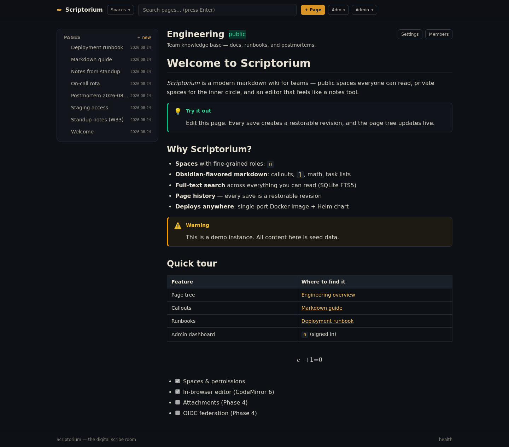
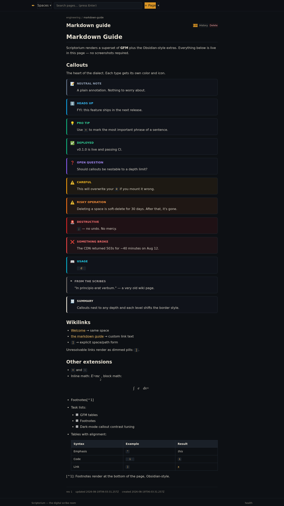
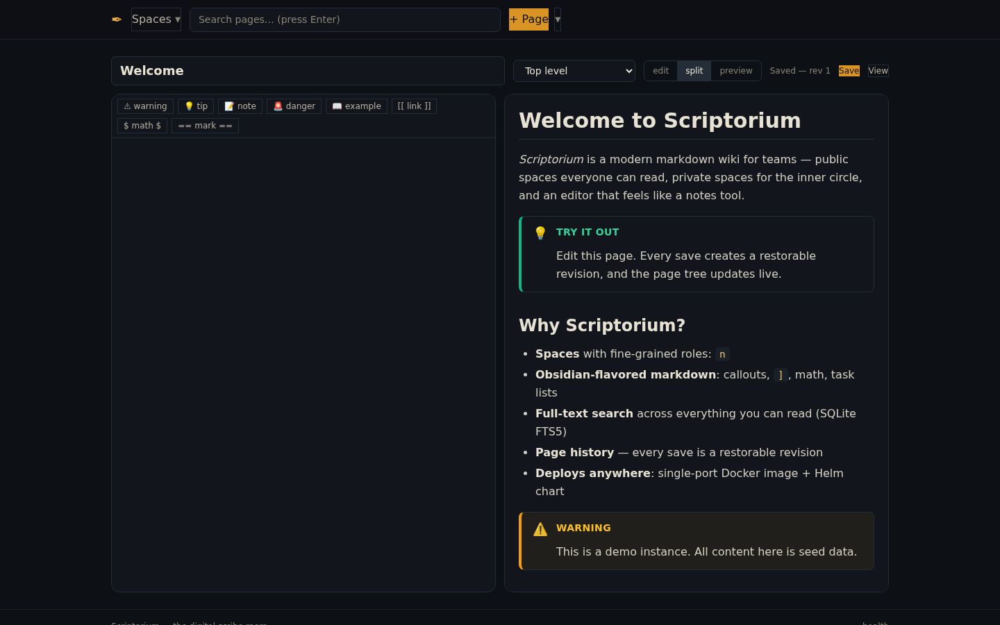
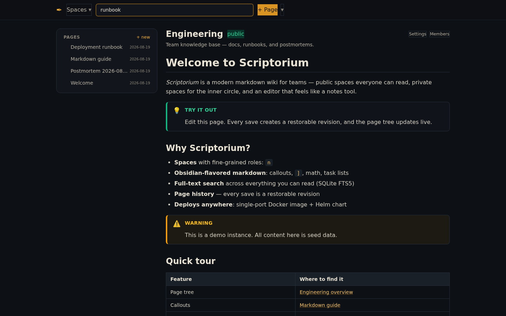
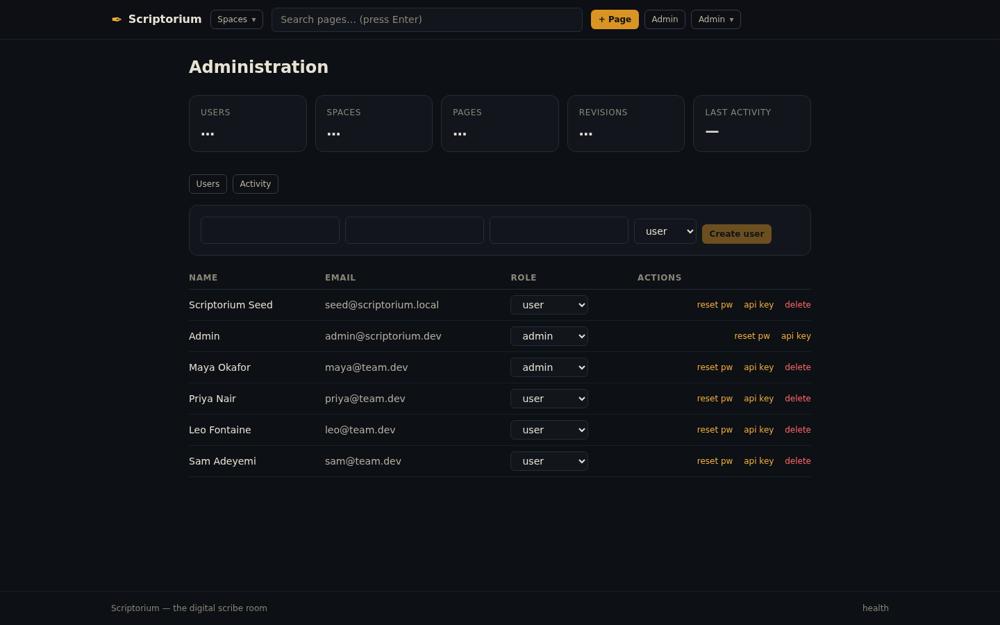
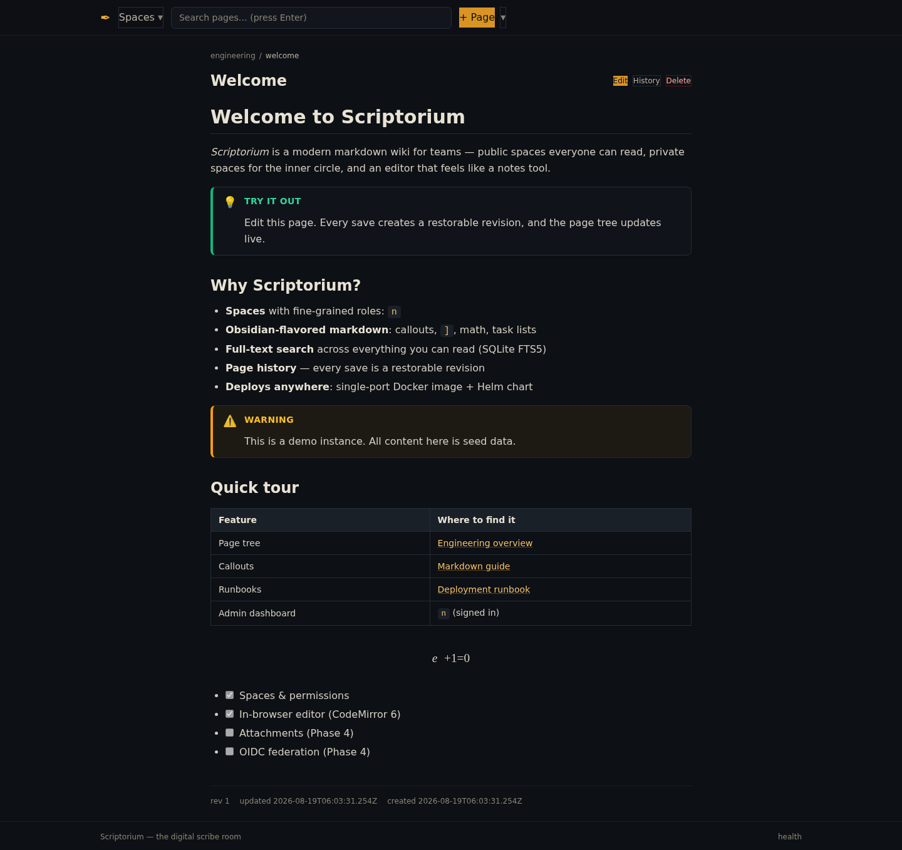

# Scriptorium

*Scriptorium* — a modern markdown wiki for teams. Public spaces everyone can read,
private spaces for the inner circle, and an editing experience that feels like a
notes tool rather than a CMS.

> Scriptorium: the room in a medieval monastery where scribes copied books by hand.
> This is its digital successor — the same idea, without the candle soot.

## Features

- **Spaces** — public spaces are readable by anyone (including anonymous visitors);
  private spaces require membership.
- **Permissions** — role ladder `viewer → editor → maintainer → admin`, enforced
  server-side on every request.
- **In-browser markdown editor** — CodeMirror 6 with markdown syntax highlighting,
  live preview (split view), autosave, callout templates, wiki links.
- **Obsidian-flavored markdown** — `[[wikilinks]]`, callout boxes
  (`> [!warning]`, `> [!tip]`, `> [!caution]`, `> [!danger]`, `> [!note]`,
  `> [!example]`, `> [!question]`, custom types), math, task lists, highlight.
- **Full-text search** across all pages you can read (SQLite FTS5).
- **Page history** — every save creates a restorable revision.
- **Auth** — email + password (argon2id), HMAC session cookies, password reset,
  API keys for scripting.
- **Activity log** — who edited what, when.
- **Deployment** — single-port Docker image (GHCR) + Helm chart. SQLite storage in a
  data directory; no external database required.

## Screenshots

All pages are server-rendered markdown — callouts, tables, math, wiki links — with a CodeMirror 6 editor and split preview.

| Space & page tree | Markdown dialect (12 callout types, math, wikilinks) | In-browser editor (split view) |
|---|---|---|
|  |  |  |

| Search | Admin dashboard | A wiki page (callouts, table, KaTeX) |
|---|---|---|
|  |  |  |

## Quick start (Docker)

```bash
docker run -d --name scriptorium \
  -p 8787:8787 \
  -v scriptorium-data:/data \
  ghcr.io/aetherionflux/scriptorium:latest
```

Open http://localhost:8787 — the first account you register becomes **admin**.

## Kubernetes (Helm)

The chart is validated in CI and packaged as a release artifact on version
tags (`v*` → GitHub Release → `scriptorium-<version>.tgz`).

```bash
# from a release artifact
helm install scriptorium <release-url>/scriptorium-0.1.0.tgz \
  --set image.repository=ghcr.io/aetherionflux/scriptorium \
  --set image.tag=v0.1.0 \
  --set persistence.size=10Gi

# or straight from a clone of this repo
git clone https://github.com/AetherionFlux/scriptorium.git
helm install scriptorium ./scriptorium/charts/scriptorium
```

See [docs/deployment.md](docs/deployment.md) for full options.

## Development

```bash
npm install
npm run dev        # full stack (UI + API) on http://localhost:5173
npm test           # vitest (server-side dialect + permissions)
npm run check      # svelte-check
npm run build      # production build → web/build (adapter-node)
npm start          # run the production build (PORT, DATA_DIR env)
```

## Repository layout

```
server/           # API framework-agnostic core: db, auth, permissions, markdown engine
web/              # SvelteKit 2 app: UI + +server/api routes that delegate to server/
docs/             # architecture, markdown dialect, API reference, deployment
charts/scriptorium/  # Helm chart
.github/workflows/ # CI (lint/test/build) + publish (Docker → GHCR)
```

## Documentation

- [Roadmap](ROADMAP.md)
- [Architecture](docs/architecture.md)
- [Markdown dialect](docs/markdown.md)
- [HTTP API reference](docs/api.md)
- [Deployment (Docker / Kubernetes / bare metal)](docs/deployment.md)

## License

MIT — see [LICENSE](LICENSE).